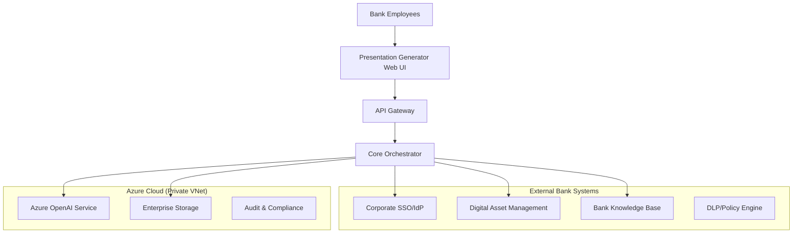
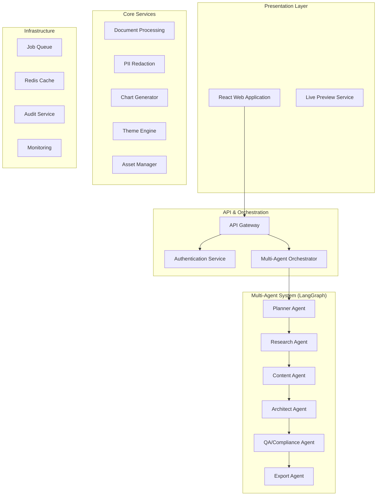
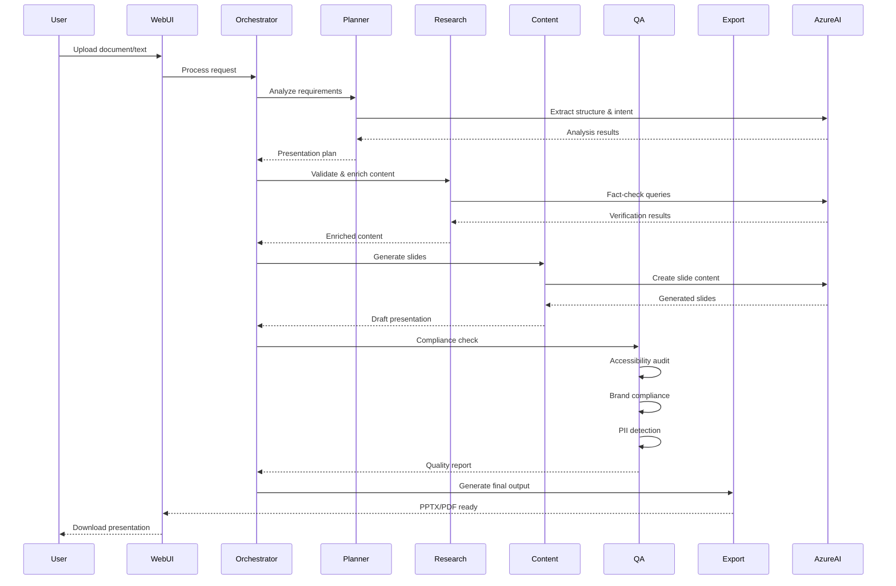
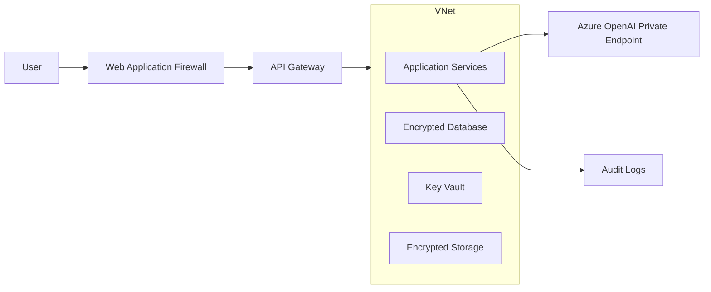

# Architecture Documentation - Text-to-Presentation Generator

## Executive Summary
Enterprise-grade text-to-presentation generator designed for private banking with multi-agent architecture, built on LangGraph and Azure OpenAI, meeting strict compliance and security requirements.

## System Context (C4 Level 1)

## Container Architecture (C4 Level 2)

## Multi-Agent Workflow (Sequence Diagram)

## Technology Stack Rationale

### Core Framework
- **LangGraph**: Multi-agent orchestration with state management
- **Python 3.11+**: Enterprise-approved runtime
- **FastAPI**: High-performance async API framework
- **Pydantic**: Data validation and serialization

### AI/ML Services
- **Azure OpenAI GPT-4o**: Enterprise LLM with data processing guarantees
- **Azure Cognitive Services**: Document intelligence and PII detection
- **Private endpoint**: VNet isolation, no internet egress

### Security & Compliance
- **Azure AD B2C**: Enterprise SSO integration
- **Azure Key Vault**: Secrets and certificate management
- **Azure Application Gateway**: WAF and SSL termination
- **Presidio**: Advanced PII detection and anonymization

### Data & Storage
- **Azure Blob Storage**: Document and asset storage with encryption
- **Azure Redis Cache**: Session and job state management
- **Azure SQL Database**: Audit logs and metadata

### Presentation Generation
- **python-pptx**: PPTX creation and manipulation
- **Pillow**: Image processing and chart generation
- **matplotlib/plotly**: Enterprise-approved charting
- **WeasyPrint**: PDF generation with accessibility

### Infrastructure
- **Azure Container Apps**: Serverless container hosting
- **Azure Service Bus**: Reliable message queuing
- **Application Insights**: Monitoring and telemetry
- **Bicep**: Infrastructure as Code

## Security Architecture

### Data Flow Security

### Security Controls
1. **Network Isolation**: Private VNet with no internet egress
2. **Encryption**: TLS 1.3 in transit, AES-256 at rest
3. **Identity**: Azure AD with conditional access
4. **Authorization**: RBAC with fine-grained permissions
5. **Audit**: Immutable logs for all operations
6. **Content Safety**: Built-in content filtering and PII detection

## Decision Log

### Decision 1: Multi-Agent Architecture with LangGraph
**Context**: Need coordinated AI agents for complex presentation generation
**Decision**: Use LangGraph for agent orchestration
**Rationale**: 
- Native state management
- Composable agent workflows
- Enterprise Python ecosystem
- Clear separation of concerns

### Decision 2: Azure OpenAI over Other Providers
**Context**: Bank requires enterprise LLM with data guarantees
**Decision**: Azure OpenAI with private endpoints
**Rationale**:
- Data processing agreements
- Private networking
- EU data residency
- Content safety controls

### Decision 3: Container-based Deployment
**Context**: Need scalable, maintainable deployment
**Decision**: Azure Container Apps with Bicep IaC
**Rationale**:
- Serverless scaling
- Version control infrastructure
- Blue-green deployments
- Cost optimization

## Performance Requirements
- **Generation Time**: <30 seconds for 10-12 slides
- **Concurrent Users**: 100+ simultaneous sessions
- **Availability**: 99.9% uptime SLA
- **Data Residency**: EU-only processing and storage

## Compliance Framework
- **GDPR**: PII detection and right to erasure
- **EBA Guidelines**: Operational resilience
- **WCAG 2.1 AA**: Accessibility compliance
- **ISO 27001**: Information security management
- **SOC 2 Type II**: Service organization controls
