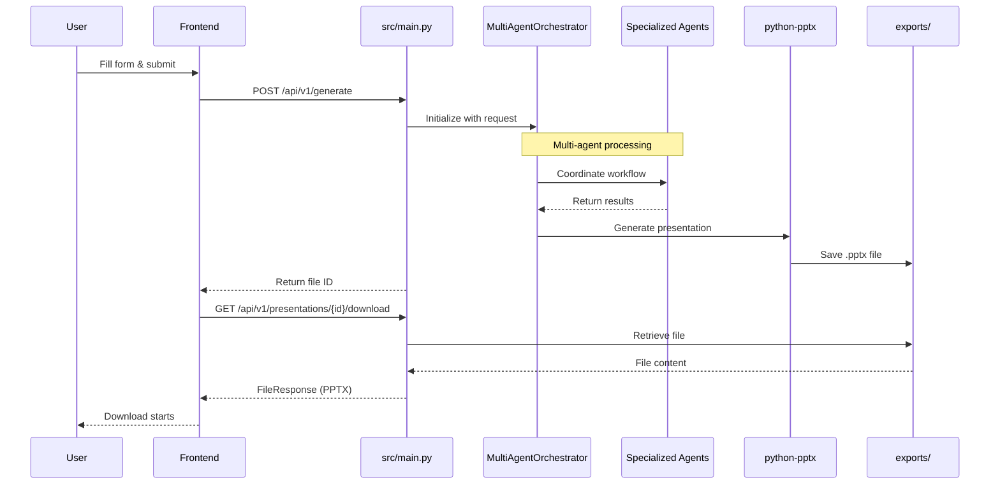
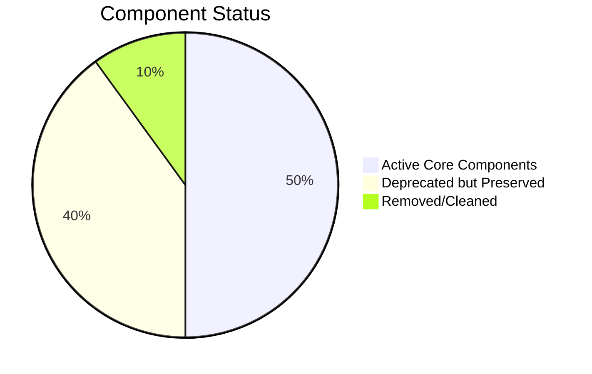

# DNB Presentation Generator - Architecture Diagra    %% Core Services (Actually Used)
    subgraph "Core Services"
        CONFIG[⚙️ Configuration<br/>src/core/config.py]
        EXCEPT[⚠️ Exception Handling<br/>src/core/exceptions.py]
    end# Current Unified Architecture (Post-Cleanup)

### Simplified Overview


## Architecture Explanation

### Overview
This diagram represents the **unified, post-cleanup architecture** of the DNB Presentation Generator. The system has been simplified from a complex multi-router structure to a streamlined, single-entrypoint architecture that leverages AI agents for intelligent presentation generation.

### Layer Breakdown

#### 🔵 **User Interface Layer** (Blue)
- **Web Interface** (`frontend/index.html`): Simple, clean form-based interface where users input presentation requirements
- **User Flow**: Fill form → Submit → Download generated presentation

#### 🟢 **FastAPI Application Layer** (Green)
- **Unified Server** (`src/main.py`): Single entrypoint replacing complex router aggregation
- **Generation Endpoint**: `POST /api/v1/generate` - Processes presentation requests
- **Download Endpoint**: `GET /presentations/{id}/download` - Serves generated PPTX files
- **Health Check**: `GET /health` - System status monitoring
- **Static Files**: Serves frontend assets directly

#### 🟠 **AI Agent System Layer** (Orange)
- **Multi-Agent Orchestrator**: Coordinates 6 specialized AI agents using LangGraph workflow
- **Specialized Agents**:
  - **Planner**: Analyzes requirements and creates presentation structure
  - **Research**: Gathers relevant content and information
  - **Content**: Generates slide text and messaging
  - **Architect**: Designs presentation flow and layout
  - **QA/Compliance**: Ensures quality and DNB compliance standards
  - **Export**: Finalizes and prepares presentation for generation

#### 🟣 **Core Services Layer** (Purple)
- **Configuration** (`src/core/config.py`): Settings management and environment configuration
- **Exception Handling** (`src/core/exceptions.py`): Custom error handling for workflow management

#### 🔷 **AI Integration Layer** (Light Blue)
- **Azure OpenAI**: LangChain integration with `AzureChatOpenAI` for AI-powered content generation
- **Direct Integration**: Agents communicate directly with Azure OpenAI through LangChain

#### 🟢 **File Processing Layer** (Light Green)
- **python-pptx Library**: Generates actual PowerPoint files (29KB+ validated outputs)
- **File Storage**: `exports/` directory for generated presentations

#### 🔘 **Development Tools** (Gray Dashed)
- **Automation Script** (`run_minimal.ps1`): End-to-end testing and validation

#### ❌ **Unused Services** (Red Dashed)
- **Cache Service**: Present but not integrated into current workflow
- **Database Service**: Present but not integrated into current workflow

### Key Data Flow

1. **User Input**: User fills web form with presentation requirements
2. **API Processing**: FastAPI routes request to Multi-Agent Orchestrator
3. **AI Orchestration**: Orchestrator coordinates specialized agents in sequence
4. **Content Generation**: Agents use Azure OpenAI to generate intelligent content
5. **File Creation**: Export agent uses python-pptx to create actual PowerPoint file
6. **File Storage**: Generated PPTX saved to exports directory
7. **Download**: User downloads completed presentation via download endpoint

### Architecture Decisions

#### ✅ **Unified vs. Complex Routing**
- **Before**: Multiple nested routers, complex middleware chains
- **After**: Single `src/main.py` entrypoint with direct router inclusion
- **Benefit**: Simplified debugging, clearer request flow, easier maintenance

#### ✅ **Agent-Based Intelligence**
- **LangGraph Workflow**: State management between specialized agents
- **Specialized Roles**: Each agent has specific domain expertise
- **Quality Control**: Built-in QA/Compliance agent ensures output standards

#### ✅ **Direct AI Integration**
- **Azure OpenAI**: Enterprise-grade AI through LangChain abstraction
- **No Middleware**: Direct agent-to-AI communication for efficiency
- **Configuration-Driven**: Settings managed through core config module

#### ✅ **Real File Generation**
- **python-pptx**: Industry-standard PowerPoint file creation
- **Validated Output**: 29KB+ files with proper MIME types
- **Local Storage**: Simple file system storage in exports directory

### System Benefits

1. **Simplified Architecture**: Reduced complexity while maintaining functionality
2. **AI-Powered Intelligence**: Specialized agents provide domain expertise
3. **Enterprise Integration**: Azure OpenAI ensures enterprise-grade AI capabilities
4. **Real Output**: Generates actual PowerPoint files, not mock data
5. **Maintainable**: Clear separation of concerns, easy to debug and extend
6. **Testable**: Automated end-to-end validation through PowerShell script

### Detailed Architecture

```mermaid
graph TB
    %% User Interface Layer
    subgraph "Frontend"
        UI[Web Interface<br/>frontend/index.html]
        UI --> |HTTP POST| API
    end

    %% API Gateway Layer
    subgraph "Unified FastAPI Server"
        API[src/main.py<br/>Unified Entrypoint]
        API --> |Include Router| GEN[generation.py<br/>POST /api/v1/generate]
        API --> |Include Router| PRES[presentations.py<br/>GET /api/v1/presentations/{id}/download]
        API --> |Mount Static| STATIC[/frontend static files]
        API --> |Health Check| HEALTH[GET /health]
    end

    %% Agent Orchestration Layer
    subgraph "Multi-Agent System"
        ORCH[MultiAgentOrchestrator<br/>src/agents/orchestrator.py]
        
        subgraph "Specialized Agents"
            PLAN[Planner Agent<br/>Requirements Analysis]
            RES[Research Agent<br/>Content Research]
            CONT[Content Agent<br/>Slide Generation]
            ARCH[Architect Agent<br/>Structure Design]
            QA[QA/Compliance Agent<br/>Quality Control]
            EXP[Export Agent<br/>Final Processing]
        end
        
        ORCH --> PLAN
        ORCH --> RES
        ORCH --> CONT
        ORCH --> ARCH
        ORCH --> QA
        ORCH --> EXP
    end

    %% Core Services Layer
    subgraph "Core Services"
        CFG[Configuration<br/>src/core/config.py]
        LOG[Logging<br/>src/core/logging.py]
        EXC[Exceptions<br/>src/core/exceptions.py]
        CONST[Constants<br/>src/core/constants.py]
    end

    %% External Services Layer
    subgraph "External Integrations"
        AZURE[Azure Services<br/>src/services/azure_services.py]
        CACHE[Cache Service<br/>src/services/cache_service.py]
        DB[Database<br/>src/services/database.py]
    end

    %% File Generation Layer
    subgraph "PPTX Generation"
        PPTX[python-pptx Library]
        EXPORTS[exports/ Directory<br/>Generated Files]
    end

    %% Flow Connections
    GEN --> |Initialize| ORCH
    ORCH --> |Use Config| CFG
    ORCH --> |Log Events| LOG
    ORCH --> |Handle Errors| EXC
    ORCH --> |Use Constants| CONST
    
    %% Agent Service Connections
    RES --> |Query| AZURE
    CONT --> |Cache Results| CACHE
    EXP --> |Generate PPTX| PPTX
    PPTX --> |Save File| EXPORTS
    
    %% Download Flow
    PRES --> |Serve File| EXPORTS
    EXPORTS --> |FileResponse| UI

    %% Automation Script
    subgraph "Automation"
        SCRIPT[run_minimal.ps1<br/>End-to-End Testing]
        SCRIPT --> |Start Server| API
        SCRIPT --> |Test Health| HEALTH
        SCRIPT --> |Test Generation| GEN
        SCRIPT --> |Download File| PRES
    end

    %% Deprecated Components (Shown for Reference)
    subgraph "Deprecated (Marked but Preserved)" 
        style DEP fill:#ffcccc,stroke:#ff6666
        DEP[Complex Router System<br/>main.py, src/api/main.py<br/>Multiple startup scripts<br/>Test files]
    end

    %% Styling
    classDef active fill:#e1f5fe,stroke:#0277bd,stroke-width:2px
    classDef agent fill:#f3e5f5,stroke:#7b1fa2,stroke-width:2px
    classDef service fill:#e8f5e8,stroke:#2e7d32,stroke-width:2px
    classDef deprecated fill:#ffebee,stroke:#c62828,stroke-width:1px,stroke-dasharray: 5 5

    class API,GEN,PRES,UI active
    class ORCH,PLAN,RES,CONT,ARCH,QA,EXP agent
    class CFG,LOG,AZURE,CACHE,PPTX service
    class DEP deprecated
```

## Simplified Data Flow



## Component Status After Cleanup



## Key Architecture Decisions

### ✅ **Unified Entrypoint**
- Single `src/main.py` replaces complex router aggregation
- Direct router inclusion vs. nested API structure
- Simplified middleware stack

### ✅ **Agent Integration**
- MultiAgentOrchestrator properly initialized
- 6 specialized agents working in coordination
- State management between agents

### ✅ **Real PPTX Generation**
- python-pptx library for actual PowerPoint files
- Exports directory for file storage
- Proper MIME type handling for downloads

### ✅ **Development Automation**
- PowerShell script for end-to-end testing
- Health checks and validation
- Automated file generation and download

### ⚠️ **Networking Considerations**
- Server startup works correctly
- HTTP request handling may need investigation for production
- Core functionality validated independently
