# DNB Presentation Generator: From Concept to Code

## A Beginner's Guide to Building an AI-Powered Application

---

### **Chapter 1: Introduction - What Are We Building?**

Welcome to the DNB Presentation Generator! Imagine you need to create a detailed PowerPoint presentation for a meeting. Normally, this involves hours of work: researching topics, writing content, structuring slides, and formatting everything correctly.

What if you could automate this entire process?

That's exactly what this project does. It's a web application where you can enter a topic, and an intelligent system will automatically generate a complete PowerPoint presentation for you. It's like having a team of expert research assistants, content writers, and designers working for you, delivering a finished product in minutes.

**The Goal: An Automated Presentation Assistant**

At its heart, this project is an "AI-powered assistant." You give it a command (the presentation topic), and it handles the entire workflow, from initial planning to final file creation.

To make this happen, we use a few key technologies that we'll explore in this book:

1.  **FastAPI**: This is our project's "manager" or "receptionist." It's a Python framework that creates a web server to handle incoming requests from the user. When a user fills out the form on our web page, FastAPI is the first to receive it. It's responsible for understanding what the user wants and delegating the work to the right team.

2.  **AI Agents (The Expert Team)**: This is the core of our application's intelligence. We don't just have one single AI; we have a team of six specialized "agents." Each agent is a small, focused AI program with a specific job:
    *   One plans the presentation structure.
    *   One researches the content.
    *   One writes the text for the slides.
    *   ...and so on.
    This specialization makes the final output much higher quality.

3.  **Azure OpenAI (The Super-Brain)**: This is the powerful language model that gives our agents their intelligence. Think of it as the vast library or knowledge base that our expert team consults to do their work. We use a popular library called **LangChain** to make it easy for our Python code to "talk" to this brain.

4.  **`python-pptx` (The Assembly Tool)**: Once the AI team has all the content and structure ready, we need a way to build the actual `.pptx` file. This Python library is our tool for the job. It takes the text, titles, and slide layouts and assembles them into a real PowerPoint presentation that you can download and open.

In this book, we will walk through every part of this project, chapter by chapter. We'll start with the big picture, then dive into each component, looking at the actual code and explaining how it works in simple terms. By the end, you'll understand not just *how* this project works, but *why* it was built this way, and you'll have the knowledge to modify or extend it yourself.

---

### **Chapter 2: The Big Picture - Our Project's Architecture**

Before we dive into the code, let's look at the project's blueprint, or "architecture." Just like a building has a plan, a software project needs a structure to ensure all the pieces fit together correctly.

We can visualize our project's architecture like this:

```mermaid
graph TB
    subgraph "User Interface"
        USER[👤 User] --> UI[🌐 Web Interface]
    end
    subgraph "FastAPI Application"
        UI --> |Request| MAIN[⚡ Main Server]
        MAIN --> GEN[📝 Generation Endpoint]
        MAIN --> PRES[📥 Download Endpoint]
    end
    subgraph "AI Agent System"
        GEN --> ORCH[🎯 Orchestrator]
        ORCH --> PLAN[📋 Planner] & RES[🔍 Researcher] & CONT[✍️ Content] & ARCH[🏗️ Architect] & QA[✅ QA] & EXP[📤 Exporter]
    end
    subgraph "Core & AI Services"
        ORCH --> CONFIG[⚙️ Configuration]
        ORCH --> EXCEPT[⚠️ Exceptions]
        ORCH --> AZURE[☁️ Azure OpenAI]
    end
    subgraph "File Processing"
        EXP --> PPTX[📄 python-pptx] --> EXPORTS[📁 File Storage]
        PRES --> EXPORTS
    end
```



Let's break down what each of these layers does, using a simple analogy of a custom-tailoring shop.

**1. The User Interface (The Customer's Visit)**

*   **What it is**: This is the `frontend/index.html` file. It's a simple web page with a form.
*   **Analogy**: This is the front of our shop. The customer (the **User**) walks in and fills out an order form (**Web Interface**) specifying the kind of suit they want (the presentation topic).

**2. The FastAPI Application (The Shop Manager)**

*   **What it is**: This is our Python web server, run by `src/main.py`. It listens for customer orders.
*   **Analogy**: The shop manager (**Main Server**) takes the order form. They don't make the suit themselves. Instead, they have two main tasks:
    *   For a new order, they take it to the workshop (**Generation Endpoint**).
    *   When a customer comes to pick up a finished suit, they get it from the storage room (**Download Endpoint**).

**3. The AI Agent System (The Workshop of Master Tailors)**

*   **What it is**: This is where the real magic happens. It's a team of AI agents managed by an **Orchestrator**.
*   **Analogy**: The workshop is run by a lead tailor (the **Orchestrator**), who manages a team of specialists:
    *   **Planner**: Measures the client and sketches the initial design.
    *   **Researcher**: Selects the finest fabrics and threads.
    *   **Content (Cutter/Stitcher)**: Cuts the fabric and stitches it together.
    *   **Architect**: Ensures the overall structure (jacket, pants) is correct.
    *   **QA (Quality Assurance)**: Checks for loose threads or crooked seams.
    *   **Exporter**: Irons the suit, puts it in a bag, and prepares it for pickup.

**4. Core & AI Services (The Tools and Rulebooks)**

*   **What it is**: These are shared resources that the agent team uses.
*   **Analogy**: Every tailor in the workshop uses the same set of tools:
    *   **Configuration (`config.py`)**: The book of measurements and client preferences. It also holds the key to the main library.
    *   **Exceptions (`exceptions.py`)**: The rulebook for what to do when something goes wrong (e.g., the fabric tears).
    *   **Azure OpenAI**: A massive library of fashion design and tailoring knowledge that the specialists can consult at any time to get ideas or solve problems.

**5. File Processing (The Final Assembly and Storage)**

*   **What it is**: The final stage where the presentation is created and stored.
*   **Analogy**: The **Exporter** agent uses a special machine (`python-pptx`) to assemble the final suit. Once done, the finished suit is placed in the **File Storage** room (`exports/` directory), ready for the customer to pick up.

This layered structure is very effective. It separates concerns, meaning each part of the system has a clear, defined job. The manager doesn't need to know how to sew, and the stitcher doesn't need to talk to the customer. This makes the system easier to manage, debug, and upgrade. In the next chapters, we'll open the door to each of these rooms and see how they work up close.

---

### **Chapter 3: The Front Door - Our Web Page and FastAPI Server**

Every web application needs a way for users to interact with it. In our project, this is a simple HTML web page. But how does a Python program show a web page to a user? The answer is our web server, **FastAPI**.

In this chapter, we'll look at two key files:
1.  `frontend/index.html`: The user's view.
2.  `src/main.py`: The server that delivers this view.

**1. The User's View: `frontend/index.html`**

This is a standard HTML file. If you open it, you'll see it contains a basic form. The important parts are:

*   A **text area** for the user to type in their presentation topic.
*   A **submit button** to send the request.
*   Some **JavaScript** code that takes the topic from the text area and sends it to our FastAPI server when the button is clicked.

The key piece of JavaScript looks something like this:

```javascript
fetch('/api/v1/generate', {
    method: 'POST',
    headers: { 'Content-Type': 'application/json' },
    body: JSON.stringify({ topic: user_topic })
});
```

This code does two things:
1.  It specifies the "address" to send the data to: `/api/v1/generate`. This is one of the specific endpoints our FastAPI server is listening on.
2.  It sends the data using the `POST` method, which is the standard way to send new information to a server. The topic is neatly packaged in a format called JSON.

**2. The Server: `src/main.py`**

This Python file is the heart of our web server. It uses the `fastapi` library to create a server that can handle web requests. Let's look at the key parts of this file.

**Setting up the FastAPI App**

At the top of the file, we create our app instance:

```python
from fastapi import FastAPI

app = FastAPI(title="DNB Presentation Generator")
```

This `app` object is our main server. We will now tell it how to handle different requests at different addresses (or "routes").

**Serving the Web Page**

How does the user get the `index.html` file in the first place? We tell FastAPI to make the `frontend` directory available as "static files."

```python
from fastapi.staticfiles import StaticFiles

# This line tells FastAPI to serve any file in the 'frontend' directory.
app.mount("/", StaticFiles(directory="frontend", html=True), name="static")
```

The `html=True` part is a handy shortcut. It means if a user visits the main URL (like `http://localhost:8000`), FastAPI will automatically serve the `index.html` file from that directory. This is how our front door opens.

**Creating a Health Check Endpoint**

It's always a good idea to have a simple way to check if our server is running correctly. We create a special endpoint for this, called a "health check."

```python
@app.get("/health")
def health_check():
    return {"status": "ok", "message": "Server is running"}
```

*   `@app.get("/health")`: This is a "decorator." It tells FastAPI that any time a user makes a `GET` request to the `/health` URL, the `health_check` function below it should be run.
*   `GET` is the method used when you just want to retrieve information (like when you type a URL in your browser).
*   The function simply returns a JSON message confirming that the server is alive and well. This is incredibly useful for monitoring and debugging.

In this chapter, we've set up our shop's front door and a way to check if the lights are on. The user can now see our order form. In the next chapter, we'll look at the most important endpoint: the one that takes the user's order and starts the presentation generation process.

---

### **Chapter 4: The Manager - Handling Requests with API Endpoints**

In the last chapter, we saw how FastAPI serves our main web page. Now, we'll focus on its most important job: receiving the user's presentation request and kicking off the AI workflow.

This is handled by our **API endpoints**, which are special functions in `src/main.py` that are tied to specific URLs. They are the "doors" that allow the frontend (the web page) to communicate with the backend (our Python code).

Our project has two main API endpoints for the generation process:
1.  `/api/v1/generate`: To start creating a new presentation.
2.  `/api/v1/presentations/{id}/download`: To download the finished presentation.

**1. The Generation Endpoint: `/api/v1/generate`**

This is where the action begins. When the user clicks "Submit" on the web page, the JavaScript code sends the presentation topic to this URL using a `POST` request.

Here's the simplified code in `src/main.py`:

```python
from fastapi import FastAPI, BackgroundTasks
from pydantic import BaseModel
from .agents.orchestrator import MultiAgentOrchestrator

# ... (app setup) ...

class GenerationRequest(BaseModel):
    topic: str

@app.post("/api/v1/generate")
async def generate_presentation_endpoint(request: GenerationRequest, background_tasks: BackgroundTasks):
    orchestrator = MultiAgentOrchestrator()
    
    # Generate a unique ID for this presentation
    presentation_id = orchestrator.generate_unique_id()
    
    # Run the generation process in the background
    background_tasks.add_task(orchestrator.run_workflow, request.topic, presentation_id)
    
    return {"message": "Presentation generation started.", "id": presentation_id}
```

Let's break this down carefully:

*   **`class GenerationRequest(BaseModel)`**: This is a Pydantic model. It's a simple way to tell FastAPI what kind of data to expect. Here, we're saying, "The incoming request *must* have a piece of text called `topic`." FastAPI handles all the validation for us. If the data is missing or wrong, it automatically sends back an error.

*   **`@app.post("/api/v1/generate")`**: This decorator links our function to the URL. The `post` part is crucial; it means this endpoint is designed to *receive* data, not just serve it.

*   **`async def generate_presentation_endpoint(...)`**: This is our main function. The `async` keyword is important for web servers, as it allows them to handle many requests at once without getting stuck.

*   **`background_tasks: BackgroundTasks`**: This is a very clever feature of FastAPI. Generating a presentation can take a long time (maybe a minute or more). We don't want the user's web page to be stuck loading for that long.
    *   By using `BackgroundTasks`, we can tell FastAPI: "Start this long process, but immediately send a response back to the user to let them know we've started."

*   **`orchestrator = MultiAgentOrchestrator()`**: We create an instance of our team leader, the orchestrator.

*   **`background_tasks.add_task(...)`**: This is the key line. We are telling the background worker to run the `orchestrator.run_workflow` method. We pass it the `topic` from the user's request and a unique ID we just generated.

*   **`return {"message": ...}`**: The function *immediately* returns a message to the user's browser, confirming the process has started and giving them the `presentation_id`. The frontend can use this ID to check on the status or create a download link later.

**2. The Download Endpoint: `/presentations/{id}/download`**

Once the background task is finished, a `.pptx` file will be waiting in our `exports/` folder. We need a way for the user to download it.

```python
from fastapi.responses import FileResponse
import os

@app.get("/presentations/{presentation_id}/download")
def download_presentation(presentation_id: str):
    file_path = os.path.join("exports", f"{presentation_id}.pptx")
    
    if not os.path.exists(file_path):
        return {"error": "File not found or still generating."}
        
    return FileResponse(path=file_path, filename=f"presentation_{presentation_id}.pptx")
```

*   **`@app.get(...)`**: This is a `GET` request because the user is *retrieving* something from the server.

*   **`{presentation_id}`**: This is a "path parameter." It means the URL will contain the unique ID of the presentation, for example: `/presentations/abc-123/download`. FastAPI automatically captures this ID and passes it as an argument to our function.

*   **`file_path = ...`**: We construct the full path to where the file *should* be.

*   **`if not os.path.exists(...)`**: We check if the file is actually there. If not, the generation might have failed or is still in progress.

*   **`return FileResponse(...)`**: This is a special response type in FastAPI. It efficiently streams the file from the server to the user's browser, prompting a download dialog. We can also set a user-friendly filename.

With these two endpoints, our "manager" (FastAPI) can now fully handle the customer's journey: take the order, send it to the workshop, and deliver the finished product. Next, we'll go into that workshop and meet the team of AI agents.

---

### **Chapter 5: The Expert Team - Introduction to AI Agents**

Now we arrive at the most exciting part of our project: the "brain." What does it mean to have a team of AI agents?

An **AI Agent** is a program designed to perform a specific, complex task by reasoning and using tools. It's more than just a simple function. An agent can:
1.  **Understand a goal** (e.g., "research the financial performance of DNB").
2.  **Make a plan** to achieve that goal.
3.  **Use tools** to execute the plan (e.g., search the web, run code, or in our case, use an LLM).
4.  **Analyze the results** and adjust its plan if needed.

**Why a Team of Agents? The Power of Specialization**

Instead of creating one massive, general-purpose AI to do everything, we've adopted a more effective strategy: a **multi-agent system**. We've created a team of six highly specialized agents, each an expert in one part of the presentation-making process.

Think of it like building a house. You could hire one person who knows a little bit about everything, or you could hire a team: an architect, a plumber, an electrician, and a painter. The specialized team will almost always produce a better result.

Our team consists of:

1.  **The Planner Agent**: The architect. It receives the user's topic and its first job is to create a high-level outline for the presentation. It decides what the main sections should be and what key points each section should cover.

2.  **The Research Agent**: The investigator. It takes the outline from the Planner and uses its knowledge (from the Azure OpenAI model) to find relevant facts, data, and details for each point in the outline.

3.  **The Content Agent**: The writer. This agent receives the structured research from the Researcher. Its job is to turn those raw facts and data into well-written, engaging content suitable for a presentation slide.

4.  **The Architect Agent**: The slide designer. It takes the written content and decides how to structure it. For example, it might decide that a certain piece of content should be a title slide, another should be a bullet-point list, and another should be a concluding statement.

5.  **The QA/Compliance Agent**: The editor and fact-checker. This agent reviews the generated content to ensure it meets quality standards. It checks for clarity, consistency, and compliance with any given rules (e.g., maintaining a professional tone for DNB).

6.  **The Export Agent**: The final processor. This agent takes the fully structured and approved content and prepares it for the final output. It formats the data in the exact way that our `python-pptx` library needs to build the file.

**The Team Leader: The Multi-Agent Orchestrator**

A team of experts is no good if they don't know how to work together. That's the job of the **Multi-Agent Orchestrator** (`src/agents/orchestrator.py`).

The orchestrator is the team leader or project manager. It doesn't do any of the specialized work itself. Instead, it manages the workflow, ensuring that:
*   Each agent is called in the correct order.
*   The output from one agent is correctly passed as the input to the next.

For example, the orchestrator first calls the Planner. It takes the Planner's output (the outline) and hands it to the Research agent. It then takes the Researcher's output (the detailed facts) and hands it to the Content agent, and so on.

This process of managing a sequence of calls between different components is called a "chain" or a "graph." Our project uses a powerful library called **LangGraph** to build this workflow, which we'll explore in the next chapter. By breaking down the complex problem of "creating a presentation" into smaller, manageable tasks for specialized agents, we create a system that is both powerful and easy to understand.

---

### **Chapter 6: The Team Leader - The Multi-Agent Orchestrator**

The Orchestrator is the conductor of our AI symphony. It ensures each agent plays its part at the right time to create a harmonious final product. This is one of the most critical components of our application, and it's all managed within the `src/agents/orchestrator.py` file.

To build this workflow, we use a library called **LangGraph**. LangGraph is designed specifically for creating cyclical, agent-based systems. While a simple "chain" runs from A to B to C, a "graph" can have more complex flows, like loops, branches, and decision points.

**1. Defining the Workflow State**

First, we need a way to pass information between our agents. The orchestrator manages a central "state" object. Think of this as a shared clipboard or project folder that each agent can read from and write to.

Our state might look something like this in code:

```python
from typing import TypedDict, List

class WorkflowState(TypedDict):
    topic: str
    outline: List[str]
    research_data: dict
    slide_content: List[dict]
    # ... and so on for each step
```

When the workflow starts, the `topic` is filled in. After the Planner agent runs, it will update the `outline` field. After the Research agent runs, it will fill in the `research_data`, and this continues for the entire process.

**2. Creating the Nodes (The Agents)**

In LangGraph, each agent or processing step is a "node" in the graph. A node is simply a Python function that takes the current state as input, performs its task, and returns the changes to be made to the state.

For example, the planner node would look like this conceptually:

```python
def run_planner_node(state: WorkflowState):
    topic = state["topic"]
    planner_agent = PlannerAgent() # Create the agent
    
    # The agent generates the outline
    generated_outline = planner_agent.run(topic) 
    
    # We return the change to be made to the state
    return {"outline": generated_outline}
```

We would create a similar node function for each of our six agents.

**3. Building the Graph**

Once we have our state and our nodes, we can wire them together to create the workflow graph.

```python
from langgraph.graph import StateGraph, END

# 1. Create the graph instance
workflow = StateGraph(WorkflowState)

# 2. Add each agent as a node
workflow.add_node("planner", run_planner_node)
workflow.add_node("researcher", run_researcher_node)
workflow.add_node("content_generator", run_content_node)
# ... and so on for the other agents

# 3. Define the sequence (the "edges" of the graph)
workflow.set_entry_point("planner") # The first step is the planner
workflow.add_edge("planner", "researcher")
workflow.add_edge("researcher", "content_generator")
# ... and so on, linking each step to the next

workflow.add_edge("exporter", END) # The last step is the exporter, then the graph ends

# 4. Compile the graph into a runnable application
app = workflow.compile()
```

This code is very readable and clearly defines our process:
1.  We initialize a `StateGraph` with our shared state object.
2.  We add each of our agent functions as a named node.
3.  We define the "edges," which connect the nodes. This tells LangGraph the exact order of operations.
4.  We set an `entry_point` to tell the graph where to start.
5.  Finally, we `compile()` the graph into a runnable application.

**4. Running the Workflow**

Now, back in `src/main.py` where we called the orchestrator, the `run_workflow` method is actually quite simple. It just needs to invoke the compiled LangGraph app:

```python
# Inside the MultiAgentOrchestrator class

class MultiAgentOrchestrator:
    def __init__(self):
        self.workflow = self._build_workflow() # Builds the graph we saw above

    def run_workflow(self, topic: str, presentation_id: str):
        # The initial state for this run
        initial_input = {"topic": topic}
        
        # This runs the entire graph from start to finish
        final_state = self.workflow.invoke(initial_input)
        
        # The final state will contain the formatted data from the Export agent
        formatted_data = final_state["export_data"]
        
        # Now, create the PPTX file
        self._create_pptx(formatted_data, presentation_id)
```

The `self.workflow.invoke(initial_input)` call is where the magic happens. LangGraph takes care of running each node in sequence, passing the state automatically, until it hits the `END`.

By using LangGraph, we've created a robust, modular, and easy-to-understand system for managing our team of AI agents. If we ever want to add a new step (e.g., an "Image Search Agent"), we can simply define a new node and add it to the graph without having to rewrite the entire workflow logic.

---

### **Chapter 7: The Team's Super Brain - Using Azure OpenAI**

Our agents are smart, but they don't have all the world's knowledge built-in. To perform their tasks, they need to consult a "super brain"—a powerful Large Language Model (LLM). In our project, this brain is **Azure OpenAI**.

This chapter explains how our Python agents connect to and communicate with this powerful AI service.

**1. What is an LLM?**

An LLM is a type of AI that has been trained on a massive amount of text and code from the internet. As a result, it's incredibly good at understanding and generating human-like language. You can give it a prompt (a command or a question), and it will provide a detailed, coherent response.

For example, we can tell our Content Agent's LLM:
`"Write three short, professional bullet points for a presentation slide about DNB's Q3 financial results, based on the following data: ..."`
And the LLM will generate the text for that slide.

**2. LangChain: The Universal Translator**

Directly communicating with an AI service like Azure OpenAI can be complicated. You have to handle API keys, format requests correctly, and parse the responses. To make this process much easier, we use a library called **LangChain**.

LangChain acts as a universal translator and toolkit for working with LLMs. It provides simple, standardized ways to connect to hundreds of different AI models, including Azure OpenAI.

In our code, you'll see this line:

```python
from langchain_openai import AzureChatOpenAI
```

`AzureChatOpenAI` is a specific "connector" provided by LangChain that is designed to work perfectly with Microsoft's Azure OpenAI service.

**3. The Base Agent: Giving Every Agent a Brain**

Since all of our agents need to think, we've created a `BaseAgent` class in `src/agents/base_agent.py`. This class contains the common logic that every agent will use, including the connection to the LLM.

Here's a simplified look at how it works:

```python
# In src/agents/base_agent.py
from langchain_openai import AzureChatOpenAI
from ..core.config import get_azure_openai_config

class BaseAgent:
    def __init__(self, system_prompt: str):
        self.llm = self._create_llm_instance()
        self.system_prompt = system_prompt # The agent's main instruction

    def _create_llm_instance(self):
        # Get the connection details from our config file
        config = get_azure_openai_config()
        
        # Create the LangChain connector instance
        llm = AzureChatOpenAI(
            azure_endpoint=config["azure_endpoint"],
            api_version=config["api_version"],
            api_key=config["api_key"],
            azure_deployment=config["azure_deployment"],
            temperature=0.7 # A setting to control creativity
        )
        return llm

    def run(self, user_input: str):
        # This is where the agent "thinks"
        # It combines its main instruction with the user's specific input
        # and sends it to the LLM.
        response = self.llm.invoke(f"{self.system_prompt}\n\n{user_input}")
        return response.content
```

Let's break this down:

*   **`_create_llm_instance()`**: This private method is responsible for setting up the connection.
*   **`get_azure_openai_config()`**: It first calls a function from our `config.py` file. This is crucial for security and flexibility. We don't want to write our secret API keys directly in the code. Instead, they are stored in a separate configuration file.
*   **`AzureChatOpenAI(...)`**: It then creates an instance of the LangChain connector, passing in all the necessary details like the API key and endpoint URL.
*   **`self.llm`**: The created LLM instance is stored in `self.llm`, ready to be used.
*   **`run()` method**: When an agent needs to perform its task, it calls its `run` method. This method takes the specific input for the task (e.g., the presentation topic) and combines it with the agent's overall `system_prompt` (its core instruction, like "You are a financial research assistant"). It then sends this combined prompt to the LLM using `self.llm.invoke()` and returns the AI's response.

Each of our specialized agents (Planner, Researcher, etc.) will inherit from this `BaseAgent`. This means they all get their "brain" automatically, but each one can be given a different system prompt to define its unique specialty. For example:

```python
# Planner Agent
class PlannerAgent(BaseAgent):
    def __init__(self):
        system_prompt = "You are an expert presentation planner. Create a logical outline..."
        super().__init__(system_prompt)

# Content Agent
class ContentAgent(BaseAgent):
    def __init__(self):
        system_prompt = "You are a professional copywriter. Write clear, concise content for slides..."
        super().__init__(system_prompt)
```

This elegant design allows us to create a whole team of specialized agents while reusing the same core logic for connecting to and using the powerful Azure OpenAI model.

---

### **Chapter 8: The Rulebook - Configuration and Exception Handling**

Every well-run workshop needs a set of rulebooks and instruction manuals. In our project, this is the `src/core/` directory. This folder contains the shared logic that the entire application relies on to run smoothly, securely, and predictably.

We'll focus on two essential files:
1.  `src/core/config.py`: The instruction manual for settings and secrets.
2.  `src/core/exceptions.py`: The emergency procedures for when things go wrong.

**1. `config.py`: Managing Settings and Secrets**

Our application needs to know certain details to run, such as:
*   The API key for Azure OpenAI.
*   The endpoint URL for the Azure service.
*   The name of the AI model we want to use.

It would be a very bad idea to write these values directly in our code (`hardcoding`). If we did that, we would have to edit the code every time we wanted to change a setting, and more importantly, our secret API key would be exposed to anyone who could see the code.

The `config.py` file solves this problem. It's responsible for loading settings from a secure and flexible location. The standard practice is to use a `.env` (environment) file.

**The `.env` File**

This is a simple text file that you create in the main project directory. It is **never** shared or committed to version control (like Git). It looks like this:

```
# .env file
AZURE_OPENAI_API_KEY="your_secret_api_key_here"
AZURE_OPENAI_ENDPOINT="https://your_azure_endpoint.openai.azure.com/"
AZURE_OPENAI_DEPLOYMENT_NAME="gpt-4"
```

**Loading the Settings in `config.py`**

Our `config.py` file uses a library (like `pydantic-settings`) to automatically read this `.env` file and make the values available to our application in a safe way.

A simplified `config.py` might look like this:

```python
from pydantic_settings import BaseSettings

class Settings(BaseSettings):
    azure_openai_api_key: str
    azure_openai_endpoint: str
    azure_openai_deployment_name: str

    class Config:
        env_file = ".env" # Tell Pydantic to load from a .env file

# Create a single, reusable instance of the settings
settings = Settings()

# Create a helper function to pass the config to the agents
def get_azure_openai_config():
    return {
        "api_key": settings.azure_openai_api_key,
        "azure_endpoint": settings.azure_openai_endpoint,
        "azure_deployment": settings.azure_openai_deployment_name
    }
```

*   The `Settings` class defines the variables we expect to find. Pydantic automatically validates them, ensuring that our app won't even start if a required setting is missing.
*   The `get_azure_openai_config()` function provides a clean and simple way for other parts of our app (like the `BaseAgent`) to get the settings they need without having to know *where* the settings came from.

This approach is secure, flexible, and follows best practices for application development.

**2. `exceptions.py`: Handling Errors Gracefully**

Sometimes, things go wrong. An API key might be invalid, a network connection might fail, or an agent might produce an unexpected output. If we don't plan for these errors, our application will crash.

The `src/core/exceptions.py` file is where we define our own custom error types. This allows us to handle problems in a much more specific and controlled way.

For example, we can define a custom exception for our workflow:

```python
# In src/core/exceptions.py

class WorkflowError(Exception):
    """Custom exception for errors that occur during the agent workflow."""
    def __init__(self, message: str):
        self.message = message
        super().__init__(self.message)
```

Now, in our orchestrator or agents, if something goes wrong, we can "raise" this specific error:

```python
# In an agent file
from ..core.exceptions import WorkflowError

def some_agent_function():
    # ... some logic ...
    if result_is_bad:
        raise WorkflowError("The research agent failed to find any relevant content.")
```

Why is this better than letting the program crash? Because now we can specifically "catch" this error in a higher-level part of our application, like the main `run_workflow` method, and handle it gracefully.

```python
# In the orchestrator
def run_workflow(self, topic: str, presentation_id: str):
    try:
        # ... run the LangGraph workflow ...
        self.workflow.invoke(...)
    except WorkflowError as e:
        # If a WorkflowError occurred anywhere in the graph, we catch it here.
        print(f"A controlled error occurred: {e.message}")
        # We could log this error, mark the presentation as "failed",
        # and prevent the server from crashing.
    except Exception as e:
        # Catch any other unexpected errors
        print(f"An unexpected error occurred: {e}")
```

By defining our own configuration and exception handling systems, we make our application more **robust**, **secure**, and **maintainable**. It's a sign of a mature and well-thought-out project.

---

### **Chapter 9: The Final Product - Creating the PowerPoint File**

After all the planning, researching, and writing by our AI agents, we have the complete, structured content for our presentation. The final step is to take this data and turn it into a real `.pptx` file that the user can download.

This is the job of the **Export Agent** and the **`python-pptx`** library.

**1. The `python-pptx` Library**

`python-pptx` is a powerful Python library that allows you to create and modify PowerPoint presentations programmatically. You can think of it as a set of commands to build a presentation slide by slide.

You can:
*   Create a new, blank presentation.
*   Add a new slide with a specific layout (e.g., "Title and Content," "Title Only").
*   Add shapes to a slide, like text boxes.
*   Add text to those shapes and format it (e.g., bold, font size).
*   Save the final result as a `.pptx` file.

**2. The Role of the Export Agent**

The Export Agent's job is to be the bridge between the abstract content generated by the other agents and the concrete commands that `python-pptx` understands. The other agents don't need to know anything about PowerPoint layouts or text boxes. They just focus on generating high-quality content.

The Export Agent takes the final, structured content (e.g., a list of slide objects, each with a title and bullet points) and transforms it into the exact format needed for the final file generation step.

**3. The File Creation Process**

The final step, which is called by the orchestrator after the workflow is complete, uses `python-pptx` to build the file. Let's look at a simplified version of this code, which might live in a helper function called by the orchestrator.

```python
from pptx import Presentation
from pptx.util import Inches

def create_pptx_file(presentation_data: list, output_path: str):
    """
    Creates a .pptx file from the structured data.
    
    presentation_data is a list of dicts, e.g.:
    [
        {"type": "title", "title": "Main Title", "subtitle": "Author"},
        {"type": "content", "title": "Slide 2 Title", "content": ["Point 1", "Point 2"]}
    ]
    """
    
    # 1. Create a new presentation object
    prs = Presentation()
    
    # 2. Define slide layouts (mapping our types to PowerPoint's internal layouts)
    title_slide_layout = prs.slide_layouts[0]
    content_slide_layout = prs.slide_layouts[1]
    
    # 3. Loop through the data and create a slide for each item
    for slide_data in presentation_data:
        if slide_data["type"] == "title":
            slide = prs.slides.add_slide(title_slide_layout)
            slide.shapes.title.text = slide_data["title"]
            slide.placeholders[1].text = slide_data["subtitle"]
            
        elif slide_data["type"] == "content":
            slide = prs.slides.add_slide(content_slide_layout)
            slide.shapes.title.text = slide_data["title"]
            
            # Get the content body shape
            body_shape = slide.shapes.placeholders[1]
            tf = body_shape.text_frame
            tf.clear() # Clear any default text
            
            # Add each content point as a new paragraph
            for line in slide_data["content"]:
                p = tf.add_paragraph()
                p.text = line
                p.level = 1 # Indentation level (e.g., for bullet points)

    # 4. Save the final presentation to the specified path
    prs.save(output_path)
    print(f"Presentation saved to {output_path}")

```

Let's walk through the four main steps:

1.  **`prs = Presentation()`**: We create a new, blank presentation.

2.  **`prs.slide_layouts[...]`**: A PowerPoint theme has several built-in slide layouts. We get references to the ones we want to use, like the main title slide (layout `0`) and a standard content slide (layout `1`).

3.  **Loop and Add Slides**: We iterate through the data prepared by our agents.
    *   For each piece of data, we add a new slide using the appropriate layout (`prs.slides.add_slide(...)`).
    *   We then access the "placeholders" on that slide. A placeholder is a pre-defined box for content, like the title box or the main content body.
    *   We populate these placeholders with our text (`slide.shapes.title.text = ...`).
    *   For bullet points, we add new paragraphs to the text frame of the body shape.

4.  **`prs.save(output_path)`**: This is the final command. It takes everything we've built in memory and writes it to a `.pptx` file on the disk, located in our `exports/` directory with the unique presentation ID.

This process cleanly separates the AI's job (generating content) from the final assembly job (building the PowerPoint file). This makes the system robust and allows us to easily change the PowerPoint theme or layouts in the future without having to change the AI agents themselves.

---

### **Chapter 10: Running and Extending the Project**

Congratulations! You've now seen every major component of the DNB Presentation Generator, from the frontend HTML form to the final `.pptx` file creation. In this final chapter, we'll cover how to run the project on your own machine and offer some ideas for how you could extend it.

**1. Setting Up Your Environment**

To run a Python project, it's best practice to create a "virtual environment." This is an isolated space for your project's dependencies, ensuring they don't conflict with other Python projects on your system.

From your project's root directory, run these commands in your terminal:

```bash
# Create a virtual environment named '.venv'
python -m venv .venv

# Activate the environment
# On Windows:
.venv\Scripts\activate
# On macOS/Linux:
source .venv/bin/activate
```

You'll know it's active because your terminal prompt will change to show `(.venv)`.

**2. Installing the Dependencies**

Our project relies on several external libraries (like `fastapi`, `langchain`, and `python-pptx`). These are all listed in a `requirements.txt` file. You can install them all with one command:

```bash
pip install -r requirements.txt
```

**3. Configuring Your `.env` File**

As we discussed in Chapter 8, you need to provide your secret API keys. Create a file named `.env` in the root of the project and add your Azure OpenAI credentials:

```
# .env
AZURE_OPENAI_API_KEY="your_secret_key"
AZURE_OPENAI_ENDPOINT="https://your_endpoint.openai.azure.com/"
AZURE_OPENAI_DEPLOYMENT_NAME="your_model_name"
```

**4. Running the Server**

With everything installed and configured, you can now start the FastAPI web server. We use `uvicorn`, a high-performance server, to run our app.

```bash
uvicorn src.main:app --reload --host 0.0.0.0 --port 8000
```

*   `src.main:app`: This tells `uvicorn` where to find our FastAPI `app` instance (in the `src.main` module).
*   `--reload`: This is a fantastic feature for development. It automatically restarts the server every time you save a change to a Python file.
*   `--host 0.0.0.0`: This makes the server accessible from other devices on your network.
*   `--port 8000`: This specifies the port to run on.

Now, open your web browser and navigate to `http://localhost:8000`. You should see the presentation generator's web page!

**5. Ideas for Extending the Project**

This project is a fantastic foundation. Here are a few ideas for how you could build on it:

*   **Add an Image Agent**: Create a new agent that runs after the Content Agent. This agent could search for relevant stock photos or generate images using a model like DALL-E 3 and suggest where to place them in the presentation.

*   **Improve the Frontend**: The current frontend is very basic. You could improve it by:
    *   Adding a status indicator to show the progress of the generation.
    *   Displaying a history of previously generated presentations.
    *   Allowing the user to choose from different presentation templates or styles.

*   **Add More Slide Layouts**: Extend the `create_pptx_file` function to support more PowerPoint slide layouts, like "Two-Column Content" or "Image with Caption." You could have the Architect Agent decide which layout is best for a given piece of content.

*   **Use a Database**: Instead of just saving files to the `exports/` directory, you could integrate a database (as hinted at by the unused `database.py` file). This would allow you to store metadata about each presentation, manage user accounts, and build a more robust history feature.

*   **Refine the Agent Prompts**: The quality of the final presentation is highly dependent on the "system prompts" given to each agent. You can experiment with these prompts in the agent classes to make them better at their specific tasks. For example, you could give the QA/Compliance agent a more detailed list of DNB's branding and style guidelines to check against.

This project is a complete, end-to-end example of a modern AI application. It combines web development, a powerful multi-agent architecture, and external API integration. By understanding how these pieces fit together, you are now well-equipped to build your own amazing AI-powered tools. Happy coding!
